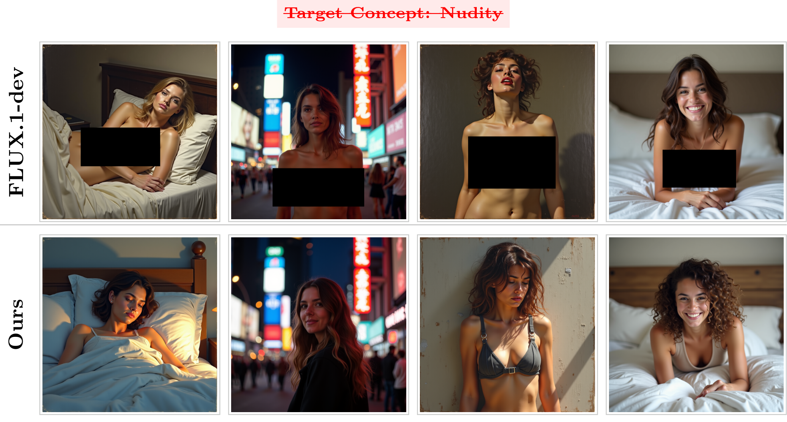

# TEA: Text Encoder Alignment for Robust Concept Erasure in Text-to-Image Models

[](https://arxiv.org/abs/2608.15341)

This repository is the official implementation of the paper
**"TEA: Text Encoder Alignment for Robust Concept Erasure in Text-to-Image Models"** (preprint).

### Authors: Alireza Dehghanpour Farashah, Zhuan Shi, Negar Rostamzadeh, Golnoosh Farnadi

## 📝 Abstract

Text-to-image diffusion models can be misused to generate harmful content through adversarial or paraphrased prompts that bypass built-in safety mechanisms. Existing concept erasure methods often suffer from limited robustness against adversarial prompts, degradation of benign generation quality, or reliance on inference-time interventions that introduce persistent computational overhead. To address these limitations, we formulate concept erasure as a domain alignment problem in the text representation space. We propose a lightweight **T**ext **E**ncoder **A**lignment framework (**TEA**) that fine-tunes only the text encoder while keeping the generative backbone fully frozen. Given concept–anchor prompt pairs, our method trains a discriminator to distinguish token-level representations of concept-containing prompts from those of safe anchor prompts, while updating the text encoder to make these representations indistinguishable. TEA introduces zero inference-time overhead and requires only a small number of fine-tuning steps, making it highly efficient to deploy at scale. Despite this efficiency, TEA achieves state-of-the-art erasure robustness against black-box and white-box adversarial attacks on Stable Diffusion v1.4, while preserving generation quality on benign prompts. Furthermore, TEA is model-agnostic and achieves the lowest attack success rate on Stable Diffusion v3.5, extending concept erasure to a Rectified Flow Transformer architecture with T5 conditioning where prior methods remain largely unexplored.


<div align=center>

</div>


## ⚠️ Content and Data Disclaimer

**This repository contains and references sexually explicit prompts, adversarial jailbreak prompts,
and figures with (censored) explicit imagery.** They appear only because removing such content is
the problem this work studies.

- **Purpose.** All prompts, prompt pairs, and benchmark files in this repository are released
  **solely for reproducibility** of the results reported in the paper and for further research on
  concept erasure and model safety. They are not intended for, and must not be used for, generating
  harmful, explicit, or otherwise unsafe content.
- **Third-party benchmarks.** The adversarial prompt sets (Ring-A-Bell, MMA-Diffusion, P4D) and the
  I2P benchmark are redistributed from their original authors for evaluation purposes only, and
  remain subject to their respective licenses and terms of use. Please cite the original work if you
  use them.
- **Responsible use.** By using this repository you agree to do so lawfully and ethically, in
  accordance with the licenses of the underlying models (Stable Diffusion, FLUX) and datasets.


## ⚙️ Method Overview

TEA adapts only the text encoder $\tau_\theta$ of a text-to-image model and leaves the generative
backbone (U-Net / Rectified Flow Transformer) and the VAE completely frozen:

1. **Concept–anchor prompt pairs.** Each concept prompt (e.g. *"a nude woman in a forest"*) is paired
   with five anchor prompts that keep the surrounding semantics but drop the target concept
   (e.g. *"a woman in a forest"*). The pairs live in `data_utils.py` / `stablediffusion_1/data_utils.py`.
2. **Token-level adversarial alignment.** A lightweight discriminator is trained to separate the
   token representations of concept prompts from those of anchor prompts, at every non-padding
   position. The encoder is then updated to fool it. The discriminator and encoder are updated in alternating steps.

Because the backbone is untouched, training takes a few seconds on a single GPU and inference is
exactly as fast as the base model.

# Setup

## Install Dependencies

1. (Optional) Create a conda environment

```bash
conda create -n tea python=3.10
conda activate tea
```

2. Install the required packages

```bash
pip install torch diffusers transformers peft accelerate \
            pandas numpy pillow tqdm wandb clean-fid \
            onnxruntime-gpu git+https://github.com/openai/CLIP.git
```

Pass `--cache_dir` to any script to point at a local directory that caches the diffusion
checkpoints (e.g. `./cache/`).

## Repository Layout

```
.
├── main.py                        # SD-v3.5 training entry point (3 text encoders)
├── trainer.py                     # SD-v3.5 adversarial training loop
├── train_utils.py                 # Discriminator, EMA, losses, checkpointing
├── config.py                      # SD-v3.5 CLI / TrainingConfig
├── data_utils.py                  # Concept–anchor prompt pairs (nudity, Van Gogh, Kelly McKernan)
├── inference_dataset.py           # SD-v3.5 generation with erased encoders
├── inference_dataset_orig.py      # SD-v3.5 generation with the unmodified model
├── evaluation_ring.py             # NudeNet-based nudity evaluation (ASR)
├── clip_score.py                  # CLIP score on COCO captions
├── fid_score.py                   # FID / KID via clean-fid
├── stablediffusion_1/             # Same pipeline for SD-v1.4 (single CLIP text encoder)
│   ├── train.py / main.py / trainer.py / train_utils.py / config.py
│   ├── data_utils.py
│   └── inference_dataset.py, inference_dataset_orig.py
└── datasets/                      # Evaluation prompt sets
    ├── nudity-ring-a-bell.csv     # Ring-A-Bell adversarial prompts
    ├── mma_prompts.csv            # MMA-Diffusion adversarial prompts
    ├── p4dn_16_prompt.csv         # P4D-N adversarial prompts
    ├── p4dk_3_prompt.csv          # P4D-K adversarial prompts
    ├── i2p.csv                    # I2P benchmark
    ├── coco_30k_10k.csv           # COCO captions for FID / CLIP score
    ├── big_artist_prompts.csv     # Artist prompts (erased + retained artists)
    └── short_niche_art_prompts.csv
```

Training defaults to **full fine-tuning** of the text encoders (no LoRA) with a token-level cosine
preservation loss (`--preservation_type token_cosine`). Pass `--use_lora` to switch to a LoRA
fine-tune instead.

---

# 1. Nudity (Explicit Content) Erasure

The `harmful_to_safe` dataset holds 50 explicit concept prompts, each paired with 5 anchor prompts.

## Training

### SD-v1.4

Paper setting: $\lambda_{\mathrm{adv}}=0.5$, $\lambda_{\mathrm{pres}}=1.0$, lr $1\times10^{-5}$ for
the text encoder and $1\times10^{-3}$ for the discriminator.

```bash
python -m stablediffusion_1.train \
    --model_name CompVis/stable-diffusion-v1-4 \
    --cache_dir ./cache/ \
    --dataset harmful_to_safe \
    --num_epochs 2 --batch_size 32 \
    --lr_encoder 1e-5 --lr_disc 1e-3 \
    --lambda_adv 0.5 --lambda_preserve 1.0 \
    --preservation_type token_cosine \
    --output_dir ./outputs_sd14 --save_model_dir ./saved_models_sd14
```

Checkpoints are written to `saved_models_sd14/text_encoder_epoch_{N}` (and `..._ema`).

### SD-v3.5-large

Paper setting: $\lambda_{\mathrm{adv}}=1.0$, $\lambda_{\mathrm{pres}}=1.0$, lr $5\times10^{-5}$ for
the two CLIP encoders and $1\times10^{-4}$ for T5, discriminators at $1\times10^{-3}$.

```bash
python main.py \
    --model_name stabilityai/stable-diffusion-3.5-large \
    --cache_dir ./cache/ \
    --dataset harmful_to_safe \
    --num_epochs 2 --batch_size 32 \
    --lr_encoder1 5e-5 --lr_encoder2 5e-5 --lr_encoder3 1e-4 \
    --lr_disc 1e-3 \
    --lambda_adv 1.0 --lambda_preserve 1.0 \
    --preservation_type token_cosine \
    --output_dir ./outputs --save_model_dir ./saved_models
```

The three encoders are trained sequentially and saved as
`saved_models/encoder_{1,2,3}_epoch_{N}` (and `..._ema`). T5 needs a smaller batch size
(`--batch_size 8` in the paper); to fit a single GPU you can also train one encoder at a time with
`--encoder_idx {1,2,3}` (1 = CLIP ViT-L, 2 = CLIP ViT-bigG, 3 = T5-XXL).

## Generation on the Adversarial Benchmarks

### SD-v1.4

```bash
for CSV in nudity-ring-a-bell mma_prompts p4dn_16_prompt p4dk_3_prompt; do
  python -m stablediffusion_1.inference_dataset \
      --model_name CompVis/stable-diffusion-v1-4 \
      --full_model_path ./saved_models_sd14/text_encoder_epoch_2 \
      --csv_path ./datasets/${CSV}.csv \
      --output_dir ./inference_sd14/${CSV}
done
```

Use `--lora_path ./saved_models_sd14 --epoch 2` instead of `--full_model_path` for LoRA runs, and
add `--use_ema` to load the EMA variant. For the unmodified model, use
`python -m stablediffusion_1.inference_dataset_orig ...`.

### SD-v3.5-large

```bash
python inference_dataset.py \
    --model_name stabilityai/stable-diffusion-3.5-large \
    --checkpoint_type full_ft \
    --enc1_ckpt ./saved_models/encoder_1_epoch_2 \
    --enc2_ckpt ./saved_models/encoder_2_epoch_2 \
    --enc3_ckpt ./saved_models/encoder_3_epoch_2 \
    --epoch 2 \
    --csv_path ./datasets/nudity-ring-a-bell.csv \
    --output_dir ./inference_sd35/ring_a_bell
```

For LoRA checkpoints use `--checkpoint_type lora --lora_path ./saved_models --epoch 2`.
For the unmodified model, use `inference_dataset_orig.py`.

## Evaluation — Attack Success Rate (NudeNet)

`evaluation_ring.py` runs the NudeNet ONNX classifier over a folder of images and reports the
fraction flagged as unsafe (the ASR). Download the NudeNet classifier checkpoint
(`classifier_model.onnx`) from the [NudeNet releases](https://github.com/notAI-tech/NudeNet)
and pass its path.

```bash
python evaluation_ring.py \
    --image-dir ./inference_sd14/nudity-ring-a-bell \
    --nudenet-path /path/to/classifier_model.onnx \
    --nudity-thr 0.6 \
    --save-dir ./eval_nudity/ring_a_bell
```

The paper uses a threshold of `0.6` on all benchmarks except MMA, where `--nudity-thr 0.45` is used
following prior work. The script writes `evaluation_logs.txt` and `evaluation_results.json` to
`--save-dir` and prints the `Toxic Ratio (Unsafe %)`, which is the reported ASR.

> **Note:** GPU inference for NudeNet requires cuDNN 9.1 (e.g. `module load cuda/12.4.0/cudnn/9.1`).
> Without it, ONNX Runtime falls back to CPU automatically.

---

# 2. Artistic Style Erasure

Two target artists are supported out of the box: **Van Gogh** (`--dataset vangogh_style_to_safe`)
and **Kelly McKernan** (`--dataset kelly_mckernan_style_to_safe_prompts`). Each concept prompt
references the target artist and is paired with 5 anchor prompts describing the same scene in a
different style.

## Training

### SD-v1.4

```bash
python -m stablediffusion_1.train \
    --model_name CompVis/stable-diffusion-v1-4 \
    --cache_dir ./cache/ \
    --dataset vangogh_style_to_safe \
    --num_epochs 2 --batch_size 32 \
    --lr_encoder 1e-5 --lr_disc 1e-3 \
    --lambda_adv 0.5 --lambda_preserve 1.0 \
    --preservation_type token_cosine \
    --output_dir ./outputs_sd14_vangogh --save_model_dir ./saved_models_sd14_vangogh
```

### SD-v3.5-large

```bash
python main.py \
    --model_name stabilityai/stable-diffusion-3.5-large \
    --cache_dir ./cache/ \
    --dataset vangogh_style_to_safe \
    --num_epochs 2 --batch_size 32 \
    --lr_encoder1 5e-5 --lr_encoder2 5e-5 --lr_encoder3 5e-4 \
    --lr_disc 1e-3 \
    --lambda_adv 1.0 --lambda_preserve 1.0 \
    --preservation_type token_cosine \
    --output_dir ./outputs_vangogh --save_model_dir ./saved_models_vangogh
```

Swap `--dataset kelly_mckernan_style_to_safe_prompts` for the second target artist.

## Generation

`datasets/big_artist_prompts.csv` contains prompts for the erased artist and for the retained
artists (column `artist`), with a fixed `evaluation_seed` per row.
`datasets/short_niche_art_prompts.csv` is a smaller niche-artist set.
Generate the same prompts twice — once with the original model and once with the erased model —
so the two image sets are paired by filename (`{case_number}_{seed}.png`).

```bash
# Original model
python -m stablediffusion_1.inference_dataset_orig \
    --model_name CompVis/stable-diffusion-v1-4 \
    --csv_path ./datasets/big_artist_prompts.csv \
    --output_dir ./artist_out/orig

# Erased model
python -m stablediffusion_1.inference_dataset \
    --model_name CompVis/stable-diffusion-v1-4 \
    --full_model_path ./saved_models_sd14_vangogh/text_encoder_epoch_2 \
    --csv_path ./datasets/big_artist_prompts.csv \
    --output_dir ./artist_out/tea_vangogh
```

For SD-v3.5, use `inference_dataset_orig.py` and `inference_dataset.py` with the same CSV.

## Evaluation — LPIPS

Style erasure is measured with LPIPS between the original and erased generations of the *same*
prompt and seed:

- **LPIPS$_e$** ↑ — over prompts referencing the erased artist (rows where `artist` is the target).
- **LPIPS$_u$** ↓ — over prompts referencing the other, retained artists.
- **LPIPS$_d$** = LPIPS$_e$ − LPIPS$_u$ ↑.

This repository does not ship an LPIPS script; the metric is computed with the reference
implementation (`pip install lpips`) over the two paired folders produced above, splitting the
rows of `big_artist_prompts.csv` by the `artist` column.

---

# 3. Benign Generation Quality (COCO)

FID and CLIP score are computed on 1k COCO captions. The inference scripts detect
`coco_30k_10k.csv` by filename, sample 1000 rows with a fixed seed, and name each image
`{coco_id}.png`.

```bash
# 1. Generate with the erased model
python -m stablediffusion_1.inference_dataset \
    --model_name CompVis/stable-diffusion-v1-4 \
    --full_model_path ./saved_models_sd14/text_encoder_epoch_2 \
    --csv_path ./datasets/coco_30k_10k.csv \
    --output_dir ./coco_out/tea

# 2. FID against the real COCO images for the same coco_ids (clean-fid)
python fid_score.py --dir1 ./coco_out/tea --dir2 ./coco_out/real --mode fid

# 3. CLIP score against the captions
python clip_score.py \
    --root-dir ./coco_out/tea \
    --csv-path ./datasets/coco_30k_10k.csv \
    --output-csv ./clip_evaluation_results.csv
```

---

# Notes

- **Training data.** The concept–anchor pairs used in the paper are embedded in `data_utils.py`
  (50 explicit prompts × 5 anchors, and 20 prompts × 5 anchors per artist). `normal_prompts` is an
  additional set of benign prompts used for monitoring during SD-v3.5 training.
- **EMA.** Enabled by default (`--ema_decay`); every checkpoint is saved in both a raw and an `_ema`
  variant. Disable with `--no_ema`.
- **Non-fixed anchor targets.** By default anchor embeddings are recomputed with the current
  encoder. `--use_fixed_target_emb` reproduces the fixed-target ablation from the appendix.
- **Transfer to FLUX.** The figure above is produced by loading the CLIP ViT-L/14 and T5-XXL
  encoders aligned for SD-v3.5-large directly into FLUX.1-dev, with no FLUX-specific training.

# Reference

If you find this work useful, please cite:

```bibtex
@misc{farashah2026teatextencoderalignment,
      title={TEA: Text Encoder Alignment for Robust Concept Erasure in Text-to-Image Models},
      author={Alireza Dehghanpour Farashah and Zhuan Shi and Negar Rostamzadeh and Golnoosh Farnadi},
      year={2026},
      eprint={2608.15341},
      archivePrefix={arXiv},
      primaryClass={cs.CV},
      url={https://arxiv.org/abs/2608.15341},
}
```
